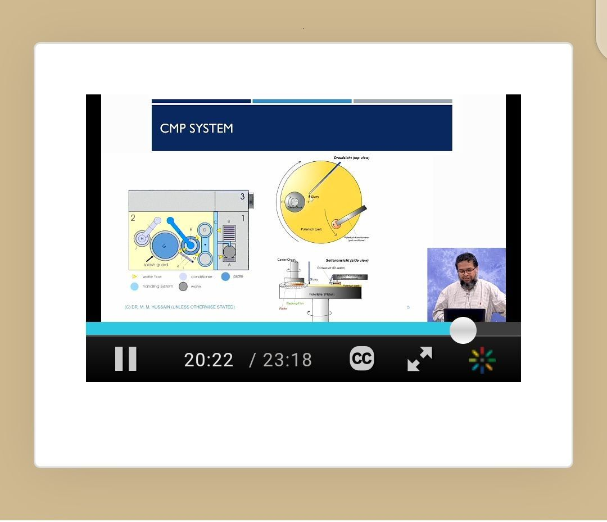

# Day 12: Interconnects and Chemical Mechanical Polishing (CMP)

**Name:** Abiodun Oluwatimilehin  
**Course:** IC Fab and Layout  
**Module:** Semiconductor Fabrication 101 (Day 12)

---

## Introduction

Day 12 of the Semiconductor Fabrication 101 course focused on **interconnects** and **chemical mechanical polishing (CMP)** — critical processes in the back-end-of-line (BEOL) stage of integrated circuit fabrication. These processes enable multi-layered chip designs, high performance, and reliable operation of modern ICs.

---

## Interconnects in Semiconductor Fabrication

Interconnects are the metallic wiring structures that electrically connect transistors, capacitors, resistors, and other devices on an IC. They:

- Distribute power, clock signals, and data across the chip  
- Directly affect chip performance, power efficiency, reliability, and yield  
- Can include over 15 layers of wiring and tens of miles of metal traces on a fingernail-sized die in advanced logic chips

### Evolution of Materials

- **Aluminum (Al) or Al alloys:** Early interconnect material; offered good adhesion, easy deposition (PVD/CVD), and simple etching. Limitations emerged as feature sizes dropped below ~200 nm, including higher resistivity (~2.8 × 10⁻⁸ Ω·cm), electromigration failures, and junction spiking.  
- **Copper (Cu):** Replaced aluminum in the late 1990s due to ~40% lower resistivity (1.7 × 10⁻⁸ Ω·cm), better electromigration resistance, and ability to support narrower lines with reduced RC delay. Copper deposition shifted fabrication from subtractive to damascene processes.

---

## Chemical Mechanical Polishing (CMP)

CMP is the process that achieves **global planarization** of the wafer, removing excess metal and barrier layers to leave perfectly flat surfaces for subsequent layers. It combines **chemical reactions** with **mechanical abrasion**:

- **Chemical aspect:** A slurry containing oxidizers and surfactants softens the top layer of material (e.g., copper oxide formation).  
- **Mechanical aspect:** The wafer is pressed against a rotating polishing pad, where abrasive nanoparticles (silica or alumina) remove the softened material.

### Material Removal Rate (MRR)

The Preston equation models CMP:

\[
MRR=Kp​⋅P⋅V
\]

Where:

- **MRR** = material removal rate  
- **Kp** = Preston coefficient (depends on slurry, material, temperature)  
- **P** = downforce pressure  
- **V** = relative velocity between wafer and pad  

In practice, the equation is modified to account for pattern effects, chemical reactivity, and non-linear behavior.

---

## Conclusion

Interconnects and CMP work together to enable modern IC fabrication:

- **Interconnects** provide the vital communication pathways for complex logic and memory circuits.  
- **CMP** provides the structural planarization necessary to stack multiple layers without defects.  

Together, they allow the transformation of a flat silicon wafer into a dense, multi-layered chip — ensuring that Moore’s Law continues to drive smaller, faster, and more efficient semiconductor devices.

---

## References

- [Semiconductor Fabrication 101 – Purdue University](https://engineering.purdue.edu/online/programs/masters-degrees/semiconductors/semiconductor-fabrication-101)
- Basic Semiconductor Manufacturing Concepts

